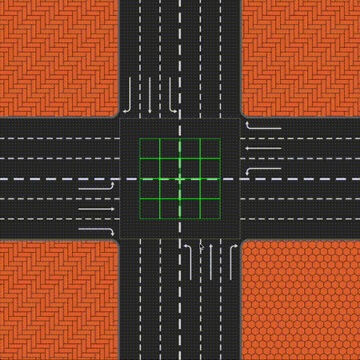

# smart_road

## Introduction
This Rust project simulates a smart intersection system designed to manage the flow of autonomous vehicles (AVs). The simulation uses a Crossing Manager that assigns time slots to approaching vehicles, coordinating their movements to safely and efficiently cross the intersection without collisions.

Instead of relying on traditional traffic signals, the Crossing Manager divides the intersection’s conflict area into collision zones. Vehicles are given specific entry times into these zones, ensuring that no two vehicles occupy the same zone at the same time. This models how future AV-dominated road systems could operate using precise timing and spatial awareness.

The project is implemented in Rust with real-time visualization using SDL2, providing an interactive view of the system’s behavior.

## Prerequisites
- Rust and Cargo installed. Follow instructions at https://www.rust-lang.org/tools/install
- [SDL2 libraries installed](./sdl2-setup.md). See below for setup instructions.
- Download or clone this repository https://github.com/AllenLeeyn/smart_road

## Running the Simulation
1. Navigate to the project directory:
   ```bash
    cd smart_road
   ``` 
2. Build and run the project using Cargo:
   ```bash
    cargo run
   ```

## User Guide

- The simulation window will open, displaying the intersection and vehicles.
- To generate a new vehicle, press the the appropriate key:
  - `W` | `Arrow Up`: Spawn a vehicle at the bottom heading North
  - `A` | `Arrow Left`: Spawn a vehicle at the right heading West
  - `S` | `Arrow Down`: Spawn a vehicle at the top heading South
  - `D` | `Arrow Right`: Spawn a vehicle at the left hading East
  - `R`: Spawn a vehicle at a random direction
  - Press `Esc` to show the stats of the simulation. Press `Esc` again to stop simulation.

- Each road (direction) has three route (lanes): turn left, go straight, turn right. Vehicles are randomly assigned a route when spawned. Different color vehicle represent different routes:
    - `Red`: Turn right
    - `Saffron`: Go straight
    - `Lavender`: Turn left

- bounding box of vehicles and zones are shown for debugging purposes.
    - For vehicle:
        - `Yellow`: approaching/ waiting
        - `Blue`: crossing/ exited
        - `Red`: braking
    - For zones:
        - `Green`: free
        - `Purple`: reserved
        - `Red`: occupied
- When a collision is detected, the vehicles will stop moving.
- Stats displayed when pressing `Esc`:
    - `Vehicles crossed`: number of vehicles that reached the other side of the intersection
    - `Collisions`: number of collisions detected (should be 0)
    - `Near misses`: number of times brakes are applied to avoid collision
    - `Max Speed`: maximum speed (px/sec) reached by any vehicle
    - `Min Speed`: minimum speed (px/sec) reached by any vehicle
    - `Average Speed`: average speed (px/sec) of all vehicles
    - `Max time in intersection`: maximum time (sec) taken by any vehicle to cross the intersection
    - `Min time in intersection`: minimum time (sec) taken by any vehicle to cross the intersection
    - `Average time in intersection`: average time (sec) taken by all vehicles to cross the intersection

## Limitations & Disclaimer
This simulation makes several simplifying assumptions to focus on demonstrating time-slot based intersection control. As such, it does not fully reflect real-world traffic dynamics:

### Vehicle Behavior
- **Constant Speed in Intersection**: Once an AV enters the intersection, it maintains a constant speed. This assumes the AV has already accelerated to its desired speed at the entry point of the intersection. In a real-world scenario, AVs may dynamically adjust their speed based on road conditions, other vehicles, or sensor feedback, but such behavior is beyond the scope of this simulation.
- **No Curved Turns**: Vehicles perform instant 90-degree turns instead of realistic curved turning paths. This design choice follows the example specification and is assumed to be acceptable within the project’s scope. Curved turns could be simulated by reserving additional zones along an arc.

### Vehicle Characteristics
- **Uniform Vehicle Size**: All vehicles have the same dimensions. While supporting different sizes is possible, the time-slot and zone allocation logic would need further abstraction and adaptation to handle varied lengths or widths safely.

### Environment Constraints
- **No Pedestrians or Mixed Traffic**: The simulation handles only autonomous vehicles. There are no pedestrians, bicycles, human-driven vehicles, or traffic signals.
- **Single Intersection Only**: The simulation models only a single 4-way intersection. Expanding this to a city grid or multiple connected intersections would require major architectural changes.

### Challenges
- **Stratgy**: We tried two different strategies (time slot allocation and a yielding system) before settling on one.
- **Speed calculation and time slot calculation missmatch**: We originally handle speed calculation/ position update with px/frames. But time slot allocation is done using duration based on seconds. Under ideal scenario where frames are updated consistently at 60fps, this mismatch won't cause much problem. But a slight consistent drop in framerate for a few seconds is enough to cause the car to not update it position properly that result in a collision. We switch position update and speed to be time based.
- **Animating curve turns**: Car struct x and y points to top left corner as that is how sdl2 `rect` is drawn. However, the rotation of the texture is around the center of the `rect`. This results in the texture drawn in an unintended location. The logical approach is to rewrite the car struct with methods to handle the bounding box tracking, rotation and texture drawing. But we attempted this at the later stage of the project and decided to focus on other projects.

## Collaborators 
- Allen [@AllenLeeyn](https://github.com/AllenLeeyn)
- Roope [@RuBoMa](https://github.com/RuBoMa)
- Johannes [@JSundb](https://github.com/JSundb)

